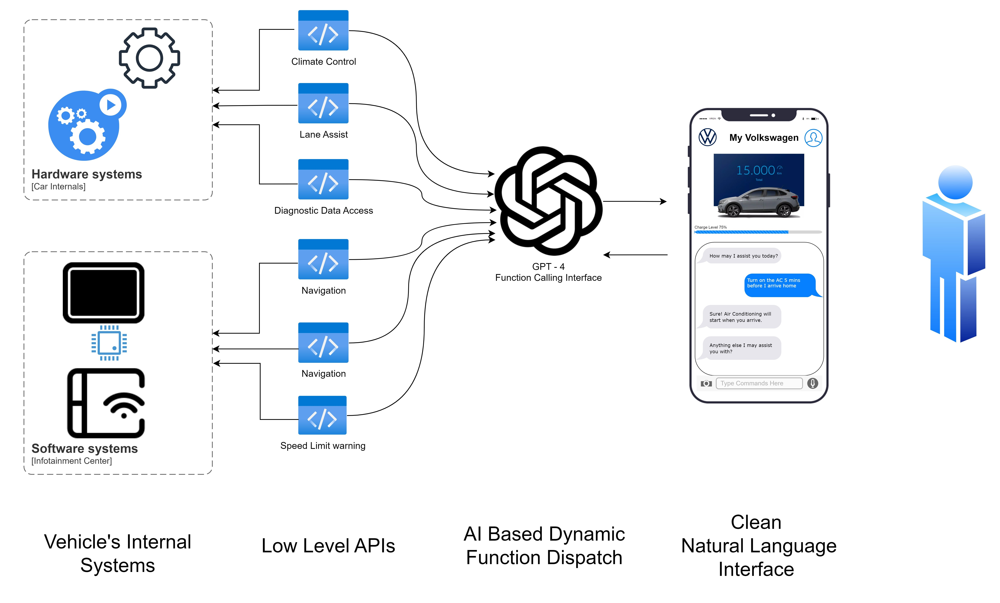
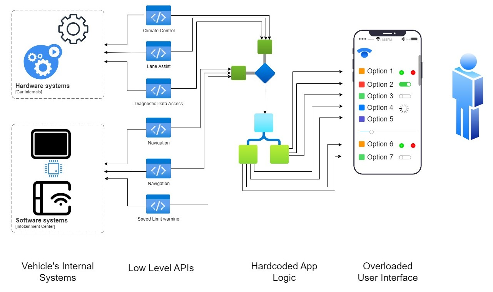

# CarGPT
Controlling And Diagnosing Your Car Using GPT


### Installation

```bash

>>> git clone https://github.com/JayantTaneja/CarGPT.git
>>> cd CarGPT
>>>
>>> pip install streamlit
>>> pip install -r requirements.txt
```

Get an OpenAI API token and store it in ```key.txt```

```bash
>>>
>>> streamlit run car_dashboard.py
>>>
```

In another terminal:

```bash
>>> streamlit run app.py
```

Enjoy !

---

### What Is This?

This project is an attempt to explore what it would be like to have an AI Agent sit inside a car. 

Imagine being able to not just control but also diagnose you car simply by asking an assistant through a clean and intuitive natural language UI.

---


### Why?

Following are some of the motivations behind this project:

1. Every time an app updates/changes UI, it becomes frustrating to re learn the new app interface. 

    **What if instead, we could have a natural language (chat/voice) UI that remained constant while the backend evolved with time?**

<br>

2. Nearly every car has decent diagnostics data collection and/or telemetry systems built in but without a licensed technician/mechanic they are hard to interpret for the common user.

    **What if we could ask an assistant questions about our car the same way we'd ask a mechanic and have an honest and quick response?**

---

### Introducing CarGPT


---

### Flow Diagram

Ours


Conventional Layout
